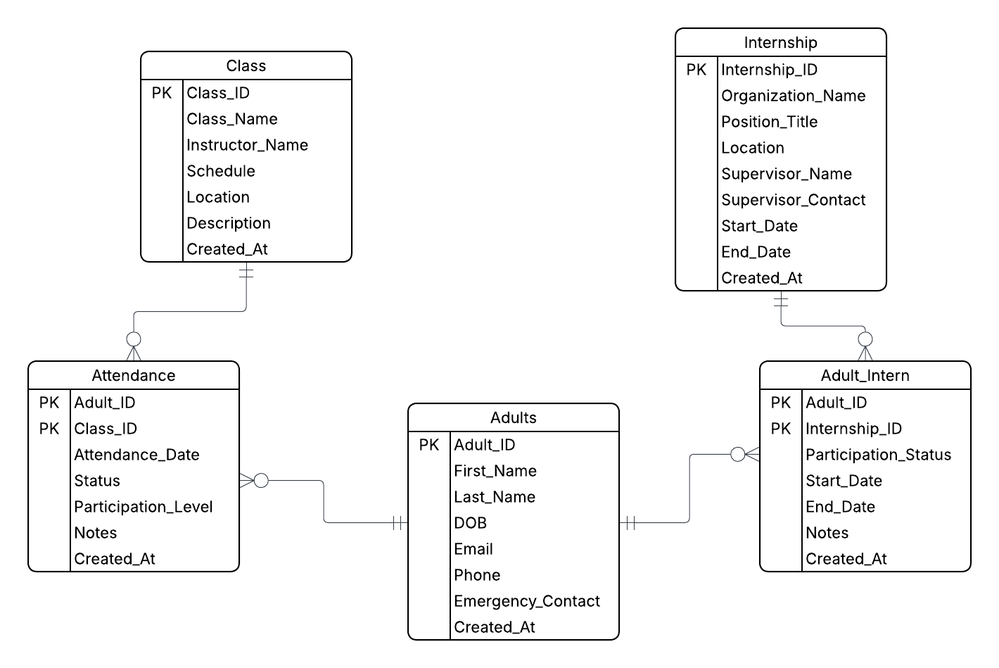

### Disabled-Adults-App

#### System Description: This is a database that tracks disabled adults and their visits to a life-skills school. It tracks their attendance as well as if they have participated (and when) in the internships offered at various local facilities.

#### Entity List & Attributes: 
##### Adults: id (serial pk), first_name (varchar 50 not null), last_name (varchar 50 not null), date_of_birth (date), email (varchar 100 unique), phone (varchar 20), emergency_contact (varchar 100), disability_notes (text), created_at (timestamp default current_timestamp).
##### Internship: id (serial pk), organization_name (varchar 100 not null), position_title (varchar 100), location (varchar 150), supervisor_name (varchar 100), supervisor_contact (varchar 100), start_date (date), end_date (date), created_at (timestamp default current_timestamp).
##### Adult_Intern: id (serial pk), adult_id (integer references adults(id) on delete cascade), internship_id (integer references internship(id) on delete cascade), participation_status (varchar 50), start_date (date), end_date (date), notes (text), created_at (timestamp default current_timestamp), unique(adult_id, internship_id).
##### Attendance: id (serial pk), adult_id (integer references adults(id) on delete cascade), class_id (integer references class(id) on delete cascade), attendance_date (date not null), status (varchar 20), participation_level (varchar 50), notes (text), created_at (timestamp default current_timestamp).
##### Class: id (serial pk), class_name (varchar 100 not null), instructor_name (varchar 100), schedule (varchar 100), location (varchar 150), description (text), created_at (timestamp default current_timestamp).

#### ERD

#### How to run locally
##### Download app.py, use secret in streamlit app

# LINK
## https://disabled-adults-app-mnn5bbzmts5txywkxtj84r.streamlit.app/
